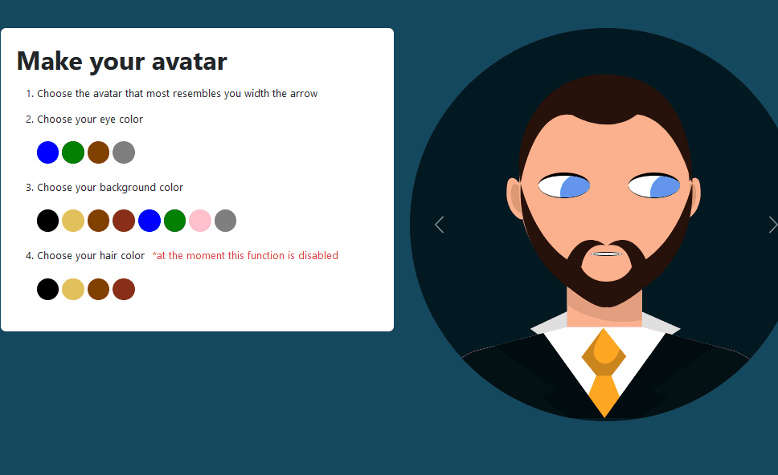

 
  

  &#xa0;

  <!-- <a href="https://movingeyes.netlify.app">Demo</a> -->

<h1 align="center">Moving Eyes</h1>

  

  

  

  

  <!--  -->

  <!--  -->

  <!--  -->

<!-- Status -->

<!-- <h4 align="center"> 
	🚧  Moving Eyes 🚀 Under construction...  🚧
</h4> 

 -->

  <a href="#dart-about">About</a> &#xa0; | &#xa0; 
  <a href="#sparkles-roadmap">Roadmap</a> &#xa0; | &#xa0;
  <a href="#rocket-run">How to run</a> &#xa0; | &#xa0;
  <a href="#memo-license">License</a> &#xa0; | &#xa0;
  <a href="https://github.com/GaferCarla" target="_blank">Author</a>

 

## :dart: About ##

This is an assigmnent for MitxPro Full development with MERN. This project focuses on the movement of the eye's iris through the "onmousemove" event. 
## :sparkles: Roadmap ##

:heavy_check_mark: I would like to add the change hair color fuction and increase avatar options.

## :rocket: How to run ##

Extra features have been added that allow customization of the appearance of a vector avatar. I also added an animation of the avatar's mouth made through the css language

If you want to know how look, click <a href="https://gafercarla.github.io/Eyes-week8.github.io/">here</a>

## :memo: License ##

This project is under license from MIT. For more details, see the [LICENSE](LICENSE.md) file.

Made with :heart: by <a href="https://github.com/GaferCarla" target="_blank">Gafer</a>

&#xa0;

<a href="#top">Back to top</a>